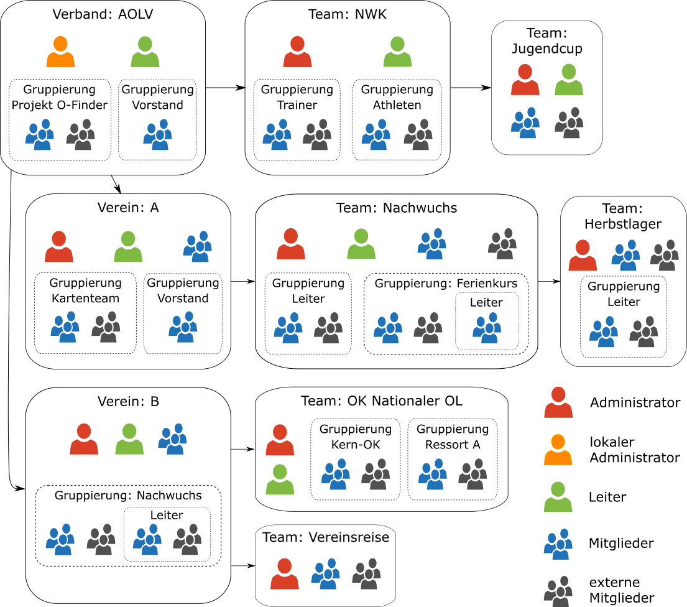

# Rollen
Personen werden mittels _Rollen_ einer _Gruppe_ (**Verband**, **Verein**,
**Team** oder **Gruppierung**) zugeordnet. Die gewählte _Rolle_ definiert die
Berechtigungen des entsprechenden Users und kann die Sichtbarkeit der Person für
User des Verbands, Vereins oder von darüber liegenden Teams einschränken. Unten
werden sämtliche definierten Rollen im Detail beschrieben.

## Übersicht
Für die folgende Beschreibung der Rollen verwenden wir eine Struktur mit zwei
Vereinen, einigen Teams und Gruppierungen. Das Beispiel ist so gewählt, dass
für jede Rolle nachvollziehbar ist, welche Daten geschrieben und/oder gelesen
werden können.

Klick auf die obige Grafik öffnet die interaktive Variante, hier kannst du mit
der Maus prüfen, welcher User welche anderen User ändern / sehen kann.

## verfügbare Rollen
Jeder User hat Vollzugriff auf seine eigenen Daten, dies wird unten nicht mehr
explizit erwähnt.

### Administrator\*in
* Berechtigungen: Vollzugriff auf alle Administratoren, Leiter und Mitglieder
  der eigenen und darunter liegenden Gruppen sowie auf externe Mitglieder der
  eigenen Gruppe inklusive Gruppierungen. Kann Teams und Gruppierungen sowie
  Mailing-Listen (Abos) erstellen.
* Verfügbarkeit: in den Gruppenarten "Verein" und "Team".

### Lokale\*r Administrator\*in
* Berechtigungen: Vollzugriff auf Personen der eigenen Gruppe inklusive 
  Gruppierungen. Kann Gruppierungen sowie Mailing-Listen (Abos) erstellen.
  Kann in diesen Gruppen Rechnungen erstellen und bearbeiten.
* Verfügbarkeit: nur in der Gruppe "Verband".

### Kassier\*in
* Berechtigungen: Rechnung erstellen und bearbeiten. Mit dieser Rolle sind keine
  Zugriffsberechtigungen verknüpft, diese müssen gegebenenfalls zusätzlich mit
  weiteren Rollen erteilt werden.
* Verfügbarkeit: nur in der Gruppenart "Verein".

### Leiter\*in
* Berechtigungen: Lesezugriff auf alle Administratoren, Leiter und Mitglieder
  der eigenen und darunter liegenden Gruppen sowie auf externe Mitglieder der
  eigenen Gruppe inklusive Gruppierungen.
* Verfügbarkeit: in allen Gruppenarten ausser "Gruppierung".

### Mitglied
* Berechtigungen
  * Ohne Login: kein Zugriff.
  * Mit Login: Lesezugriff auf Personen der eigenen Gruppe.
* Verfügbarkeit: in allen Gruppenarten.

### externes Mitglied
* Berechtigungen: gleich wie _Mitglied_
* Verfügbarkeit: in den Gruppenarten "Team" und "Gruppierung"
* Sichtbarkeit: Nur sichtbar für Mitglieder derselben Gruppe und für Leiter und
  Administratoren des direkt darüber liegenden Vereins oder Teams.
  
  Beispiele:
  * der vereinsexterne J+S Coach, der Mitglied der Nachwuchsgruppe sein sollte,
    um bei Mailings an diese Gruppe berücksichtigt zu werden.
  * Inserenten im Vereinsorgan, die ein Belegexemplar erhalten und beim
    Etikettendruck nicht vergessen werden dürfen und somit dem Team
    _Heftversand_ zugeordnet werden sollten.
